# Development Department

## New Feature Development

## Bug Fixing Process

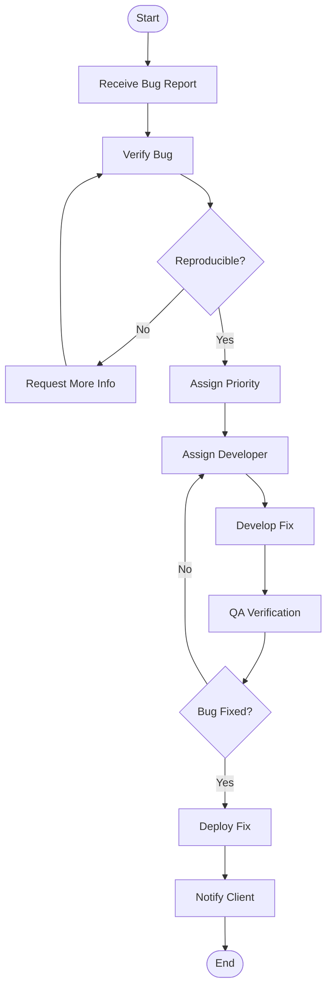
## Feature Implementation Process

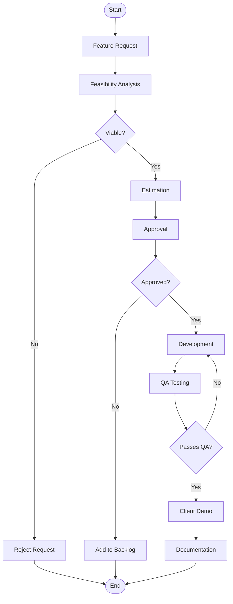

# UI/UX Department

## Design Process Flow

## User Research Process

## Design System Management

# Customer Service Department

## Support Ticket Process

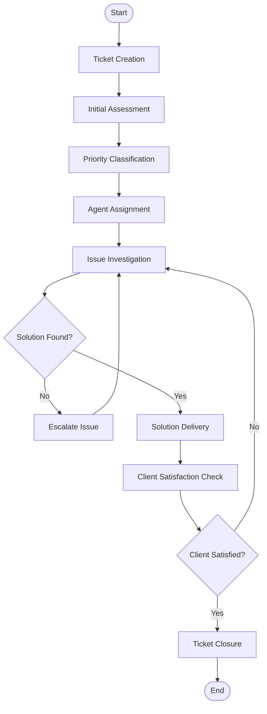

## Client Onboarding Process

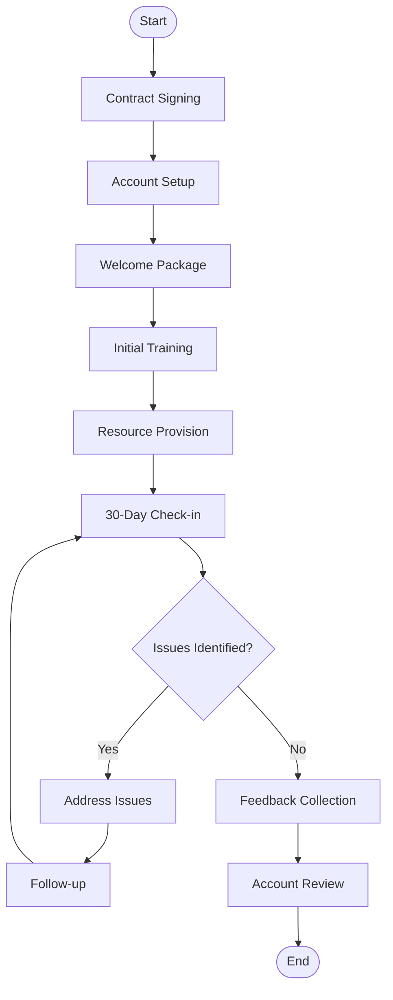

## Escalation Management Process

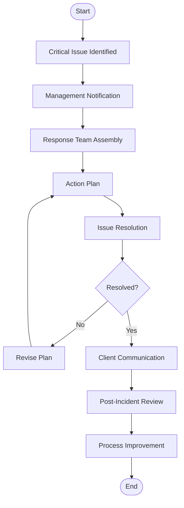

# DevOps Department

## Deployment Pipeline Process

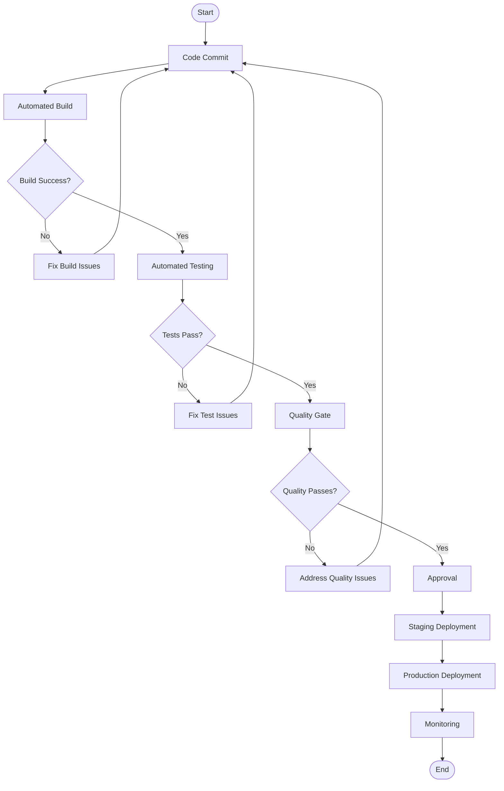

## Infrastructure Management Process

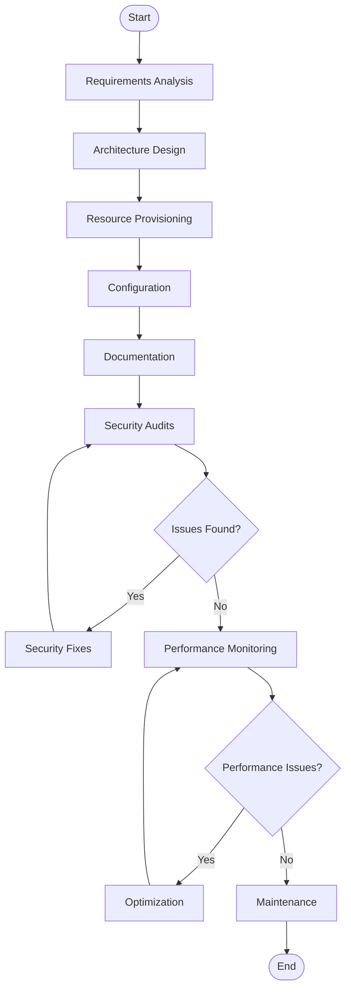

## Incident Response Process

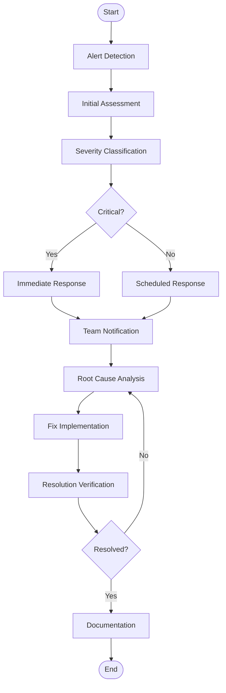

# Marketing Department

## Campaign Management Process

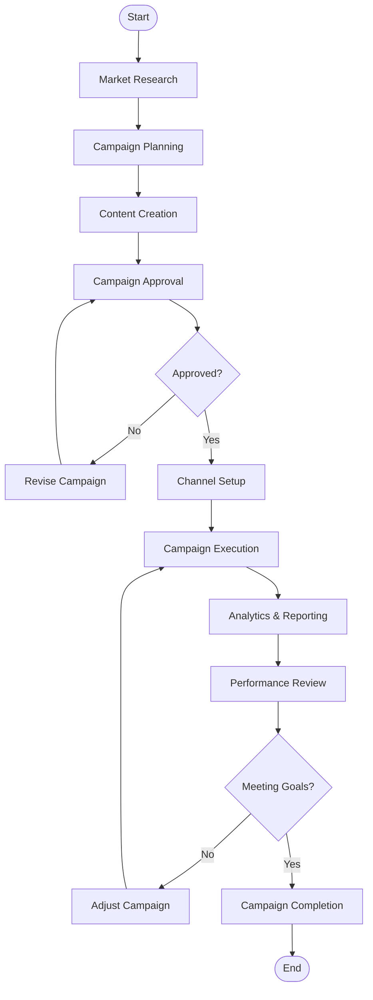

## Content Creation Process

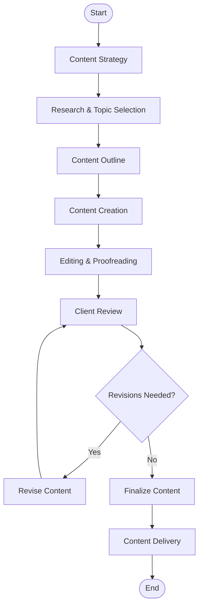

## SEO Process

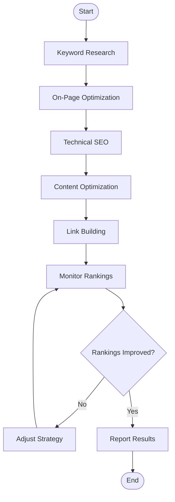

## Finance/HR Process

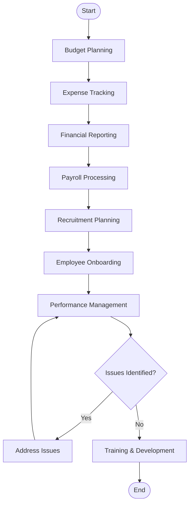
