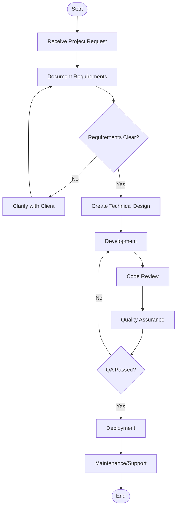

# New Feature Development

```mermaid
flowchart TD
    A([Start]) --> B[Receive Project Request]
    B --> C[Document Requirements]
    C --> D{Requirements Clear?}
    D -->|No| E[Clarify with Client]
    E --> C
    D -->|Yes| F[Create Technical Design]
    F --> G[Development]
    G --> H[Code Review]
    H --> I[Quality Assurance]
    I --> J{QA Passed?}
    J -->|No| G
    J -->|Yes| K[Deployment]
    K --> L[Maintenance/Support]
    L --> M([End])
```

# Bug Fixing Process

```mermaid
flowchart TD
    A([Start]) --> B[Receive Bug Report]
    B --> C[Verify Bug]
    C --> D{Reproducible?}
    D -->|No| E[Request More Info]
    E --> C
    D -->|Yes| F[Assign Priority]
    F --> G[Assign Developer]
    G --> H[Develop Fix]
    H --> I[QA Verification]
    I --> J{Bug Fixed?}
    J -->|No| G
    J -->|Yes| K[Deploy Fix]
    K --> L[Notify Client]
    L --> M([End])
```
# Feature Implementation Process

```mermaid
flowchart TD
    A([Start]) --> B[Feature Request]
    B --> C[Feasibility Analysis]
    C --> D{Viable?}
    D -->|No| E[Reject Request]
    E --> Z([End])
    D -->|Yes| F[Estimation]
    F --> G[Approval]
    G --> H{Approved?}
    H -->|No| I[Add to Backlog]
    I --> Z
    H -->|Yes| J[Development]
    J --> K[QA Testing]
    K --> L{Passes QA?}
    L -->|No| J
    L -->|Yes| M[Client Demo]
    M --> N[Documentation]
    N --> Z
```