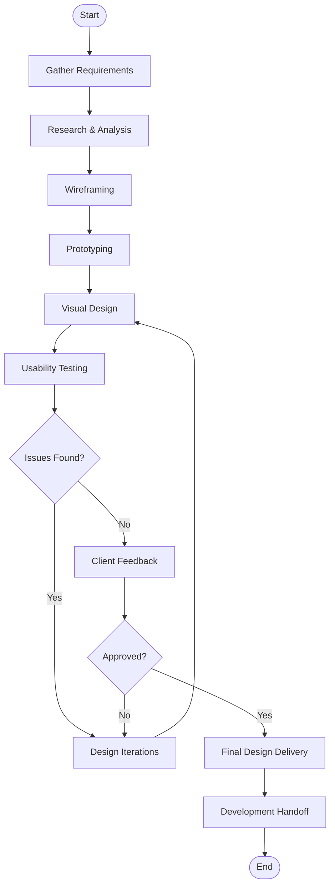
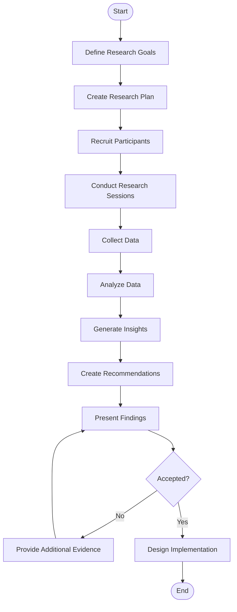
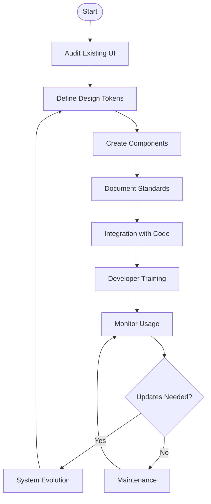

# Development Department

## New Feature Development

## Bug Fixing Process

## Feature Implementation Process

# UI/UX Department

## Design Process Flow

## User Research Process

## Design System Management

# Customer Service Department

## Support Ticket Process

