# Annual Budget Planning Process

```mermaid
flowchart TD
    start((Start)) --> timeline[Establish Budget Timeline]
    timeline --> communicate[Communicate Budget Process]
    communicate --> templates[Provide Budget Templates]
    templates --> historical[Analyze Historical Data]
    
    %% Analysis Fork
    historical --> analysisParallel{{"Analysis Phase"}}
    analysisParallel --> revenue[Revenue Analysis]
    analysisParallel --> expense[Expense Analysis]
    analysisParallel --> margin[Profit Margin Analysis]
    revenue & expense & margin --> trends[Identify Financial Trends]
    
    trends --> objectives[Establish Company Objectives]
    objectives --> targets[Define Financial Targets]
    targets --> meetings[Conduct Department Meetings]
    meetings --> requests[Collect Department Requests]
    
    %% Department Fork
    requests --> deptParallel{{"Department Reviews"}}
    deptParallel --> dev[Dev Department]
    deptParallel --> marketing[Marketing Department]
    deptParallel --> sales[Sales Department]
    deptParallel --> ops[Operations Department]
    dev & marketing & sales & ops --> review[Review Department Requests]
    
    review --> parameters{Within target<br>parameters?}
    parameters -->|No| adjustments[Request Adjustments]
    adjustments --> followup[Follow-up with Departments]
    followup --> review
    parameters -->|Yes| consolidate[Consolidate Department Budgets]
    
    consolidate --> draft[Prepare Draft Budget]
    draft --> analysis[Conduct Budget Analysis]
    
    %% Analysis Fork
    analysis --> projectionsParallel{{"Projections"}}
    projectionsParallel --> variance[Variance Analysis]
    projectionsParallel --> roi[ROI Projections]
    projectionsParallel --> cashflow[Cash Flow Projections]
    variance & roi & cashflow --> risks[Identify Budget Risks]
    
    risks --> mitigation[Create Risk Mitigation Plans]
    mitigation --> execReview[Executive Budget Review]
    
    execReview --> execApproval{Budget<br>approved?}
    execApproval -->|No| feedback[Address Executive Feedback]
    feedback --> revisions[Make Budget Revisions]
    revisions --> execReview
    execApproval -->|Yes| final[Prepare Final Budget]
    
    final --> board[Board Presentation]
    board --> boardApproval{Board<br>approval?}
    boardApproval -->|No| concerns[Address Board Concerns]
    concerns --> adjustments2[Make Required Adjustments]
    adjustments2 --> board
    boardApproval -->|Yes| finalize[Finalize Budget]
    
    finalize --> distribute[Distribute Approved Budget]
    distribute --> deptMeetings[Department Budget Meetings]
    deptMeetings --> tracking[Set Up Budget Tracking]
    tracking --> controls[Implement Budget Controls]
    
    %% Monitoring Fork
    controls --> monitoringParallel{{"Ongoing Monitoring"}}
    monitoringParallel --> monthly[Monthly Reviews]
    monitoringParallel --> quarterly[Quarterly Analysis]
    monitoringParallel --> reporting[Variance Reporting]
    monthly & quarterly & reporting --> needAdjust{Budget adjustments<br>needed?}
    
    needAdjust -->|Yes| rationale[Document Adjustment Rationale]
    rationale --> approval[Get Adjustment Approval]
    approval --> implement[Implement Adjustments]
    implement --> needAdjust
    needAdjust -->|No| yearEnd[Year-End Analysis]
    
    yearEnd --> performance[Document Performance]
    performance --> improvements[Identify Improvements]
    improvements --> endNode((End))

    %% Styling
    classDef default fill:#f9f9f9,stroke:#333,stroke-width:2px;
    classDef decision fill:#e1f3e1,stroke:#333,stroke-width:2px;
    classDef parallel fill:#f0f0f0,stroke:#333,stroke-width:2px;
    class parameters,execApproval,boardApproval,needAdjust decision;
    class analysisParallel,deptParallel,projectionsParallel,monitoringParallel parallel;
```

## About the Flowchart

This flowchart illustrates the comprehensive annual budget planning process, from initial timeline establishment to year-end analysis. The process includes:

- Initial Planning & Analysis
- Departmental Budget Reviews
- Executive & Board Approvals
- Implementation & Monitoring
- Continuous Adjustment Procedures

### Key Decision Points

1. **Parameter Validation**: Ensures department requests align with targets
2. **Executive Approval**: Senior management review and approval
3. **Board Approval**: Final authorization of the budget
4. **Adjustment Reviews**: Periodic assessment of budget performance

### Parallel Processes

- **Analysis Phase**: Revenue, Expense, and Profit Margin analysis
- **Department Reviews**: Dev, Marketing, Sales, and Operations
- **Projections**: Variance, ROI, and Cash Flow analysis
- **Monitoring**: Monthly, Quarterly, and Variance reporting

---
> **Note**: This flowchart uses Mermaid.js syntax. Ensure your Markdown viewer supports Mermaid diagrams.