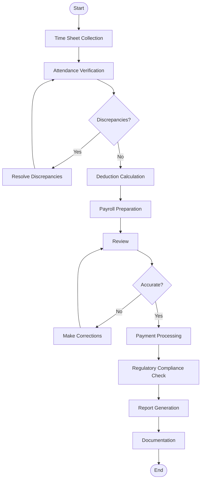
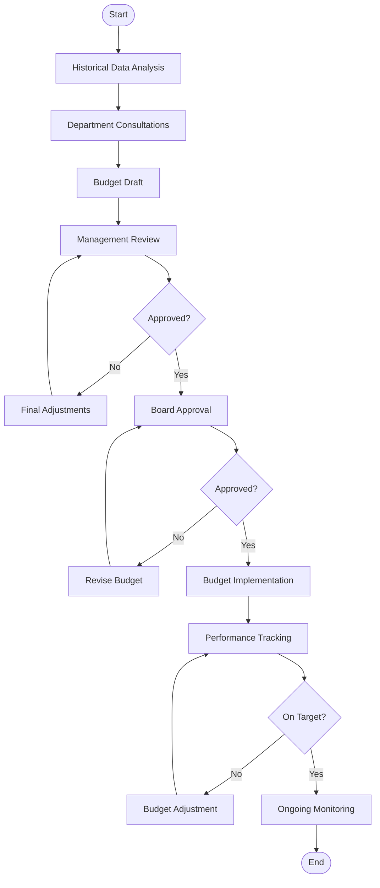

## Payroll Processing

```mermaid
flowchart TD
    A([Start]) --> B[Time Sheet Collection]
    B --> C[Attendance Verification]
    C --> D{Discrepancies?}
    D -->|Yes| E[Resolve Discrepancies]
    E --> C
    D -->|No| F[Deduction Calculation]
    F --> G[Payroll Preparation]
    G --> H[Review]
    H --> I{Accurate?}
    I -->|No| J[Make Corrections]
    J --> H
    I -->|Yes| K[Payment Processing]
    K --> L[Regulatory Compliance Check]
    L --> M[Report Generation]
    M --> N[Documentation]
    N --> O([End])
```

## Budget Planning Process

```mermaid
flowchart TD
    A([Start]) --> B[Historical Data Analysis]
    B --> C[Department Consultations]
    C --> D[Budget Draft]
    D --> E[Management Review]
    E --> F{Approved?}
    F -->|No| G[Final Adjustments]
    G --> E
    F -->|Yes| H[Board Approval]
    H --> I{Approved?}
    I -->|No| J[Revise Budget]
    J --> H
    I -->|Yes| K[Budget Implementation]
    K --> L[Performance Tracking]
    L --> M{On Target?}
    M -->|No| N[Budget Adjustment]
    N --> L
    M -->|Yes| O[Ongoing Monitoring]
    O --> P([End])
```

