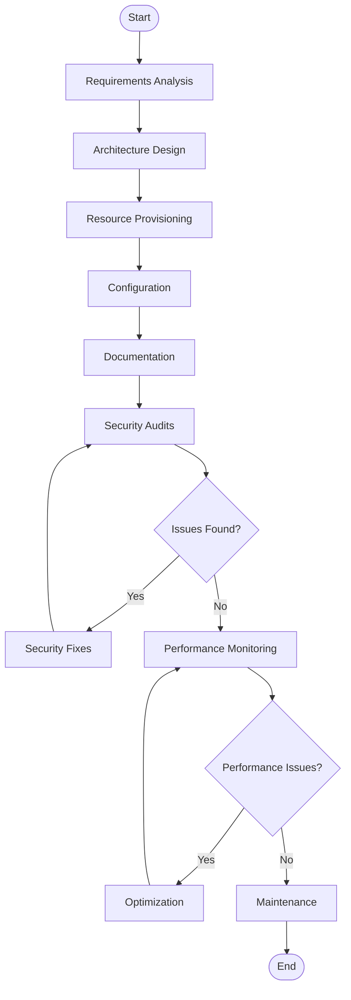
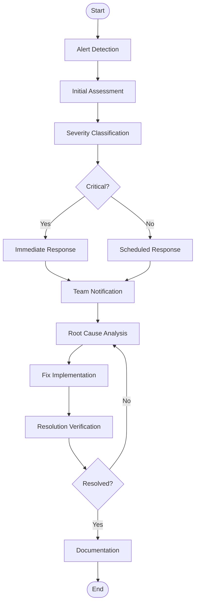
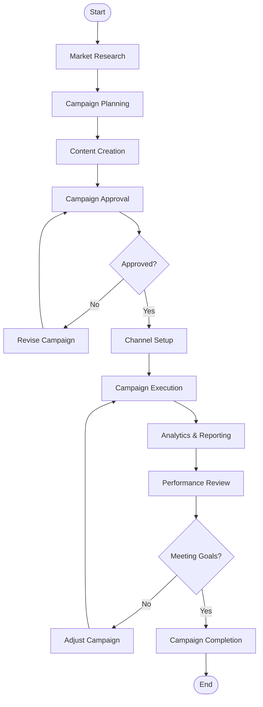
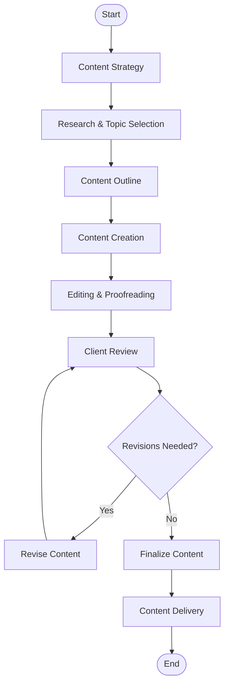
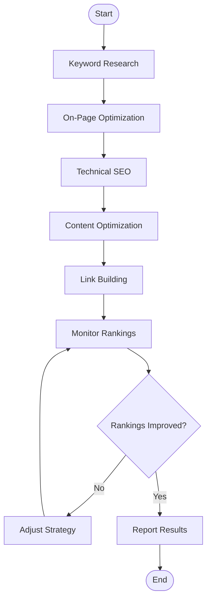
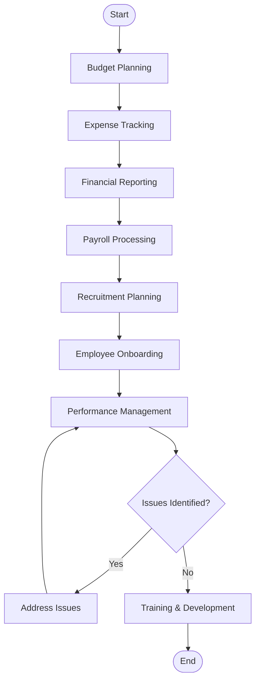

# DevOps Department

## Deployment Pipeline Process

    ```mermaid
    flowchart TD
        A([Start]) --> B[Code Commit]
        B --> C[Automated Build]
        C --> D{Build Success?}
        D -->|No| E[Fix Build Issues]
        E --> B
        D -->|Yes| F[Automated Testing]
        F --> G{Tests Pass?}
        G -->|No| H[Fix Test Issues]
        H --> B
        G -->|Yes| I[Quality Gate]
        I --> J{Quality Passes?}
        J -->|No| K[Address Quality Issues]
        K --> B
        J -->|Yes| L[Approval]
        L --> M[Staging Deployment]
        M --> N[Production Deployment]
        N --> O[Monitoring]
        O --> P([End])
    ```

## Infrastructure Management Process



## Incident Response Process



# Marketing Department

## Campaign Management Process



## Content Creation Process



## SEO Process



## Finance/HR Process


