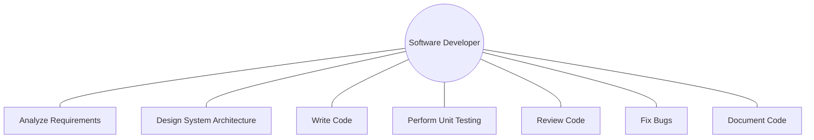
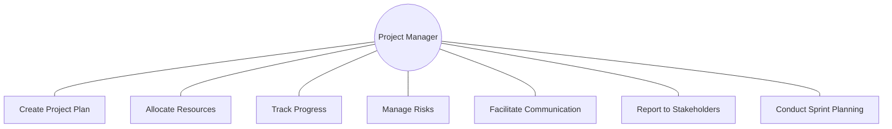
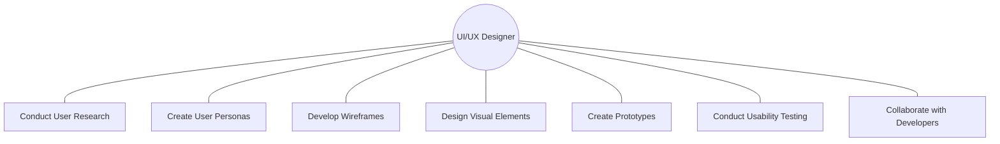
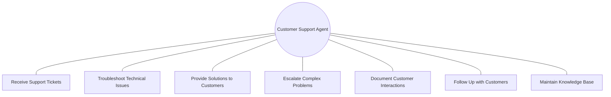
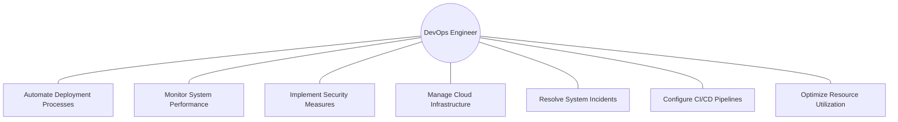
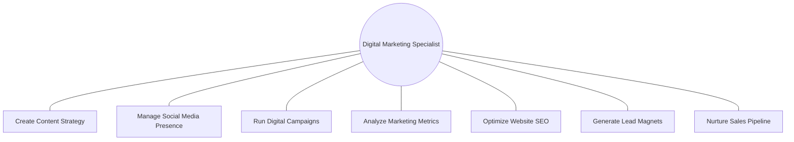
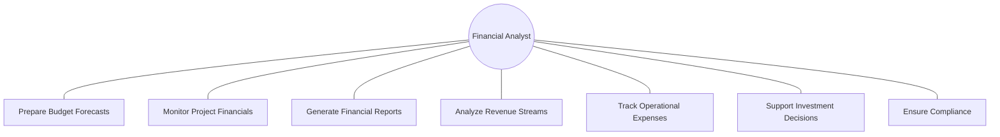
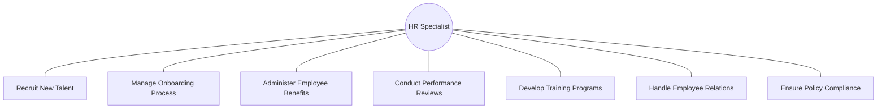

# Software Development Process

# Project Management Process

# UI/UX Design Process

# Support Management Process

# DevOps Process

# Digital Marketing Process

# Financial Management Process

# HR Management Process

