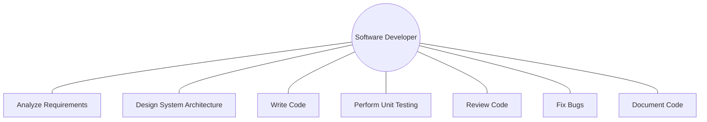

# Software Development Process

```mermaid
flowchart TB
    Developer((Software Developer))
    usecase1[Analyze Requirements]
    usecase2[Design System Architecture]
    usecase3[Write Code]
    usecase4[Perform Unit Testing]
    usecase5[Review Code]
    usecase6[Fix Bugs]
    usecase7[Document Code]
    
    Developer --- usecase1
    Developer --- usecase2
    Developer --- usecase3
    Developer --- usecase4
    Developer --- usecase5
    Developer --- usecase6
    Developer --- usecase7
```